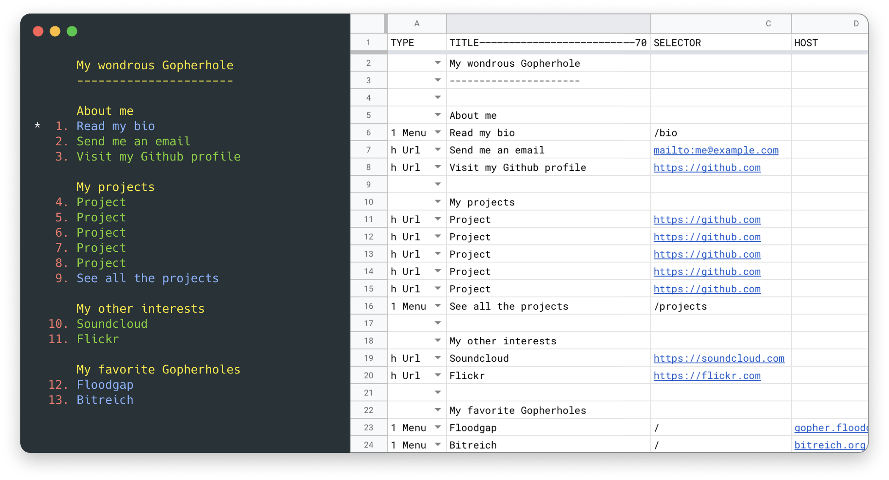

GopherSheet
===========
Serve your Gopherhole from a Google Sheet. Because why not?

Usage
---

To start serving up your Gopherhole, simply `cd` to a directory containing `credentials.json` and `gopherhole.json` files, and:

~~~sh
npx gophersheet
~~~

To obtain those files, you need to:

- [Setup up your Google account](#setting-up-your-google-account)
- [Create and setup your sheet](#creating-and-setting-up-your-sheet)
- [Configure the server](#configuring-the-server)

Setting up your Google account
---
*Must be done once per each Google account*

Before you can give GopherSheet access to your sheet, you need to create a service account. This is a special user account, with restricted access, for use by apps and scripts.

Follow the [instructions here](https://theoephraim.github.io/node-google-spreadsheet/#/getting-started/authentication?id=service-account) to set it up, then save the `credentials.json` file you got somewhere.

Creating and setting up your sheet
---
*Must be done once per each spreadheet*

Create a new Google Sheet, and share it with the service account you just created. You can find its email in the `credentials.json` file.

Instead of creating a sheet from scratch, you can also use one of the templates in the [`templates`](templates) directory to get started. Remember to share it with the service account.

The spreadsheet does not need anything special, and it's in fact a straight representation of a [traditional Gopherfile](https://en.wikipedia.org/wiki/Gopher_(protocol)#Source_code_of_a_menu).

| Type | Title         | Selector  | Host                | Port |
| ---- | ------------- | --------- | ------------------- | ---- |
| i    | My gopherhole |           |                     |      |
| i    |               |           |                     |      |
| 1    | About me      | /about    | my.gopherhole.me    | 70   |
| 1    | My projects   | /projects | my.gopherhole.me    | 70   |
| i    |               |           |                     |      |
| 1    | My projects   | /         | gopher.floodgap.com | 70   |

Each tab in the sheet represents a different Gopher page. The name of the tab will be used as the selector when a client request a resource.

Apart from the mandatory header row, each row represents a single Gopher item: a text, a link to a file, to a website, or to another menu, and so on.

The first column should contain the type of that item. If left blank, type `i` will be used, which displays static text. You can find a list of [common types here](https://en.wikipedia.org/wiki/Gopher_(protocol)#Item_types).

When linking to other Gopher resources (eg. type `0`, `1`, etc.), the `Host` and `Port` columns can point to a different Gopherhole. If left blank, they will default to your configured FQDN.

When creating www links (type `h`) the full URL must be typed in the selector column. Host and Port will be ignored.

Configuring the server
---
Create a `gopherhole.json` in the same directory you saved the `credentials.json` file earlier. Here's an example:

~~~json
{
  "SHEET_ID": "---YOUR SHEET ID HERE---",
  "FQDN": "my.gopherhole.me",
  "ADDRESS": "::",
  "PORT": 70
}
~~~

You can extract the `SHEET_ID` from the URL of your Google Sheet:

~~~
https://docs.google.com/spreadsheets/d/abcdefghijklmnopqrstuvwxyz01234567890abcdefg/edit
                                       ^^^^^^^^^^^^^^^^^^^^^^^^^^^^^^^^^^^^^^^^^^^^
~~~

Create a domain and point it to your server. Specify it as the FQDN in the configuration file, so that GopherSheet can generate the correct links.

Rather than exposing GopherSheet directly (ie. by listening on `::` or `0.0.0.0`), you might front it with a proxy like [Nginx] or [Caddy] instead.

[Nginx]: https://www.nginx.com
[Caddy]: https://caddyserver.com

License
-------
GopherSheet is licensed under the [MIT license](LICENSE.md).
